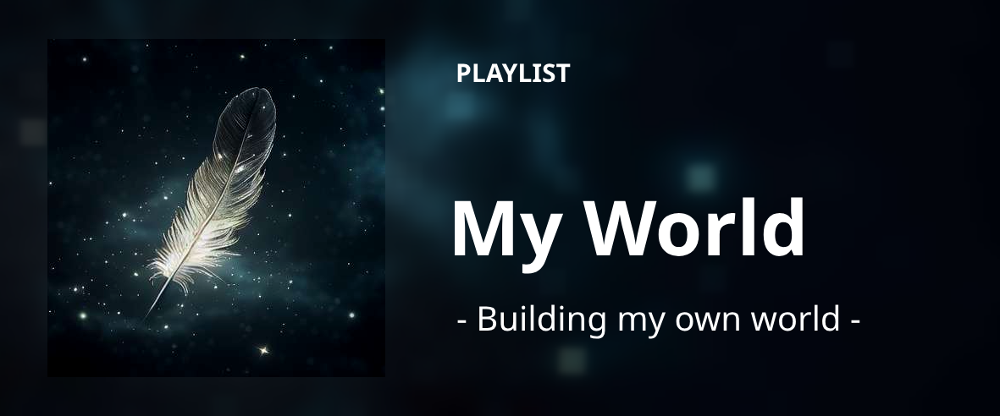

  

  <a href="https://linkedin.com/in/llamocca">
    
    <a/>

<h2 align="center">
  - Building my own world -
</h2>

...

  <a href="https://open.spotify.com/playlist/59N12Zk1LQWgzhbBRwoarb?si=f219a3b5623c4102">
    
  <a/>

 

  

